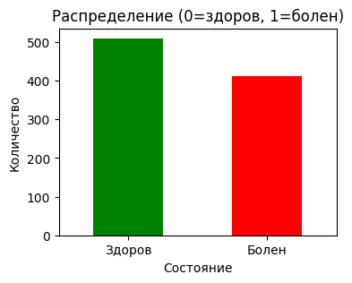
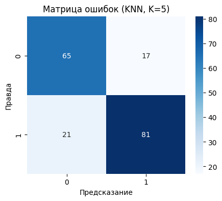
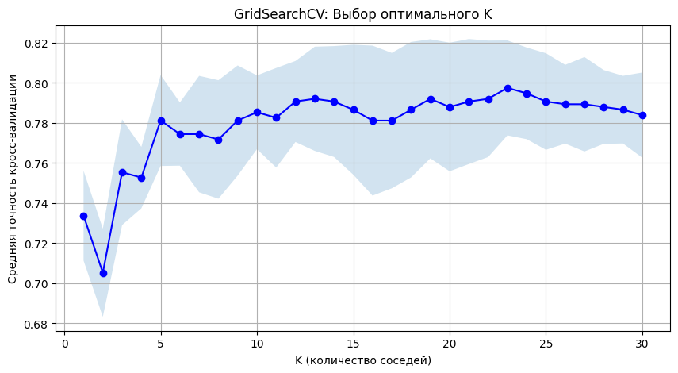
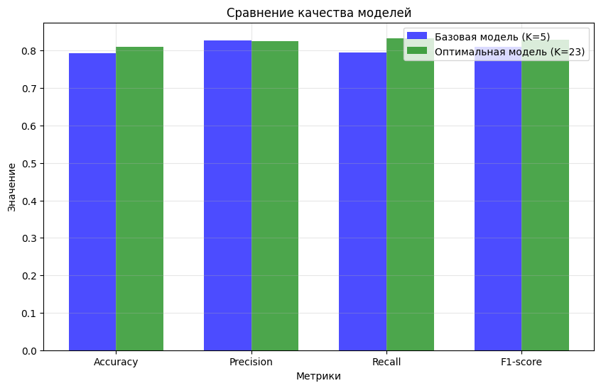

# Отчёт по лабораторной работе

## Тема: Классификация сердечных заболеваний с использованием метода K-ближайших соседей 

---

## 1. Описание задания

### 1.1 Цель работы
Построить модель классификации для предсказания наличия сердечного заболевания у пациента на основе медицинских показателей с использованием метода K-ближайших соседей.

### 1.2 Задачи работы
1. Загрузить и проанализировать датасет Heart Disease UCI
2. Выполнить предобработку данных:
   - Обработку пропусков
   - Кодирование категориальных признаков
   - Масштабирование признаков
3. Разделить выборку на обучающую и тестовую (train_test_split)
4. Обучить базовую модель KNN с произвольным параметром K=5
5. Оценить качество базовой модели по метрикам: Accuracy, Precision, Recall, F1-score
6. Выполнить подбор гиперпараметра K с помощью:
   - GridSearchCV (с K-Fold кросс-валидацией)
   - RandomizedSearchCV (со Stratified K-Fold кросс-валидацией)
7. Оценить качество оптимальной модели
8. Сравнить метрики базовой и оптимальной моделей

### 1.3 Используемые метрики качества
| Метрика | Формула | Описание |
|---------|---------|----------|
| Accuracy | (TP+TN)/(TP+TN+FP+FN) | Доля правильных ответов |
| Precision | TP/(TP+FP) | Точность предсказаний положительного класса |
| Recall | TP/(TP+FN) | Полнота (чувствительность) |
| F1-score | 2 * (P * R)/(P + R) | Гармоническое среднее Precision и Recall |

### 1.4 Исходные данные
- **Источник:** Kaggle — Heart Disease UCI
- **Размер:** 920 записей, 16 столбцов
- **Целевая переменная:** `num` (0 — здоров, 1-4 — болен)
  

### 1.5 Признаки для обучения

| Признак | Описание | Тип |
|---------|----------|-----|
| age | Возраст | Числовой |
| trestbps | Артериальное давление в покое | Числовой |
| chol | Уровень холестерина | Числовой |
| thalch | Максимальный пульс | Числовой |
| oldpeak | Депрессия ST segment | Числовой |
| ca | Количество крупных сосудов | Числовой |
| sex | Пол | Категориальный |
| fbs | Сахар в крови > 120 | Бинарный |
| exang | Стенокардия при нагрузке | Бинарный |

---

## 2. Текст программы

```python

# ИМПОРТ БИБЛИОТЕК
import pandas as pd
import numpy as np
import matplotlib.pyplot as plt
import seaborn as sns
from sklearn.model_selection import train_test_split, GridSearchCV, RandomizedSearchCV, KFold, StratifiedKFold
from sklearn.neighbors import KNeighborsClassifier
from sklearn.metrics import accuracy_score, precision_score, recall_score, f1_score, classification_report, confusion_matrix
from sklearn.preprocessing import StandardScaler

# 1. ЗАГРУЗКА ДАННЫХ
df = pd.read_csv('/kaggle/date/heart_disease_uci.csv')
print(" Датасет загружен")
print(f"Размер данных: {df.shape}")

# Создание целевой переменной (бинарная классификация)
df['target'] = (df['num'] > 0).astype(int)

# 2. ПРЕДОБРАБОТКА ДАННЫХ

# Выбор числовых признаков
numerical_features = ['age', 'trestbps', 'chol', 'thalch', 'oldpeak', 'ca']

# Создание копии данных
X = df[numerical_features].copy()

# Заполнение пропусков в числовых столбцах медианой
for col in numerical_features:
    if X[col].isnull().sum() > 0:
        X[col].fillna(X[col].median(), inplace=True)

# Добавление бинарных признаков с заполнением пропусков
df['fbs_clean'] = df['fbs'].fillna(False)
X['fbs_num'] = df['fbs_clean'].astype(int)

df['exang_clean'] = df['exang'].fillna(False)
X['exang_num'] = df['exang_clean'].astype(int)

df['sex_clean'] = df['sex'].fillna('Male')
X['sex_num'] = (df['sex_clean'] == 'Male').astype(int)

# Заполнение пропусков в ca
if X['ca'].isnull().sum() > 0:
    X['ca'].fillna(X['ca'].median(), inplace=True)

# Целевая переменная
y = df['target'].copy()

# Проверка пропусков
print(f"Пропуски в X: {X.isnull().sum().sum()}")
print(f"Пропуски в y: {y.isnull().sum()}")

# 3. МАСШТАБИРОВАНИЕ
scaler = StandardScaler()
X_scaled = scaler.fit_transform(X)
X_scaled = pd.DataFrame(X_scaled, columns=X.columns)

# 4. РАЗДЕЛЕНИЕ ВЫБОРКИ
X_train, X_test, y_train, y_test = train_test_split(
    X_scaled, y, test_size=0.2, random_state=42, stratify=y
)

print(f"Обучающая выборка: {X_train.shape}")
print(f"Тестовая выборка: {X_test.shape}")

# 5. БАЗОВАЯ МОДЕЛЬ (K=5)
knn_base = KNeighborsClassifier(n_neighbors=5)
knn_base.fit(X_train, y_train)
y_pred_base = knn_base.predict(X_test)

print("\n" + "="*50)
print("БАЗОВАЯ МОДЕЛЬ KNN (K=5)")
print("="*50)
print(f"Accuracy: {accuracy_score(y_test, y_pred_base):.4f}")
print(f"Precision: {precision_score(y_test, y_pred_base):.4f}")
print(f"Recall: {recall_score(y_test, y_pred_base):.4f}")
print(f"F1-score: {f1_score(y_test, y_pred_base):.4f}")

# 6. GRIDSEARCHCV (K-Fold кросс-валидация)
param_grid = {'n_neighbors': range(1, 31)}
kf = KFold(n_splits=5, shuffle=True, random_state=42)

grid_search = GridSearchCV(
    KNeighborsClassifier(),
    param_grid,
    cv=kf,
    scoring='accuracy',
    n_jobs=-1
)
grid_search.fit(X_train, y_train)

print("\n" + "="*50)
print("GRIDSEARCHCV РЕЗУЛЬТАТЫ")
print("="*50)
print(f"Лучшее значение K: {grid_search.best_params_['n_neighbors']}")
print(f"Лучшая CV точность: {grid_search.best_score_:.4f}")

# 7. RANDOMIZEDSEARCHCV (Stratified K-Fold)
strat_kfold = StratifiedKFold(n_splits=5, shuffle=True, random_state=42)

param_dist = {
    'n_neighbors': range(1, 51),
    'weights': ['uniform', 'distance'],
    'p': [1, 2]
}

random_search = RandomizedSearchCV(
    KNeighborsClassifier(),
    param_distributions=param_dist,
    n_iter=30,
    cv=strat_kfold,
    scoring='accuracy',
    random_state=42,
    n_jobs=-1
)
random_search.fit(X_train, y_train)

print("\n" + "="*50)
print("RANDOMIZEDSEARCHCV РЕЗУЛЬТАТЫ")
print("="*50)
print(f"Лучшие параметры: {random_search.best_params_}")
print(f"Лучшая CV точность: {random_search.best_score_:.4f}")

# 8. ОПТИМАЛЬНАЯ МОДЕЛЬ
knn_optimal = grid_search.best_estimator_
y_pred_optimal = knn_optimal.predict(X_test)

print("\n" + "="*50)
print("ОПТИМАЛЬНАЯ МОДЕЛЬ")
print("="*50)
print(f"Оптимальное K: {grid_search.best_params_['n_neighbors']}")
print(f"Accuracy: {accuracy_score(y_test, y_pred_optimal):.4f}")
print(f"Precision: {precision_score(y_test, y_pred_optimal):.4f}")
print(f"Recall: {recall_score(y_test, y_pred_optimal):.4f}")
print(f"F1-score: {f1_score(y_test, y_pred_optimal):.4f}")

# 9. СРАВНЕНИЕ МОДЕЛЕЙ
comparison = pd.DataFrame({
    'Модель': ['Базовая (K=5)', f'Оптимальная (K={grid_search.best_params_["n_neighbors"]})'],
    'Accuracy': [accuracy_score(y_test, y_pred_base), accuracy_score(y_test, y_pred_optimal)],
    'Precision': [precision_score(y_test, y_pred_base), precision_score(y_test, y_pred_optimal)],
    'Recall': [recall_score(y_test, y_pred_base), recall_score(y_test, y_pred_optimal)],
    'F1-score': [f1_score(y_test, y_pred_base), f1_score(y_test, y_pred_optimal)]
})

print("\n" + "="*50)

print("СРАВНЕНИЕ МОДЕЛЕЙ")
print("="*50)
print(comparison.to_string(index=False))

improvement = accuracy_score(y_test, y_pred_optimal) - accuracy_score(y_test, y_pred_base)
print(f"\n Изменение Accuracy: {improvement:+.4f} ({improvement*100:+.2f}%)")
```

## 3. Экранные формы с примерами выполнения программы
### 3.1 Загрузка и предобработка данных
Вывод в консоли:
```
Масштабирование выполнено
Размер X_scaled: (920, 9)
Размер обучающей выборки: (736, 9)
Размер тестовой выборки: (184, 9)
Распределение в обучении: {1: 407, 0: 329}
Распределение в тесте: {1: 102, 0: 82}
```
### 3.2 Результаты базовой модели (K=5)
Вывод в консоли:
```
Accuracy: 0.7935
Precision: 0.8265
Recall: 0.7941
F1-score: 0.8100
```
### 3.3 Матрица ошибок базовой модели
Значения матрицы:


```
Класс	Precision	Recall	F1-score	
Здоров (0)	0.76	0.79	0.77   
Болен (1)	0.83	0.79	0.81     

```
### 3.4 Результаты GridSearchCV
Вывод в консоли:
```
Лучшее значение K: 23
Лучшая кросс-валидационная точность: 0.7975
```

### 3.6 Результаты RandomizedSearchCV
Вывод в консоли:
Лучшие параметры: {'weights': 'uniform', 'p': 1, 'n_neighbors': 5}
Лучшая точность CV: 0.7962

### 3.7 Результаты оптимальной модели. Сравнение модели
Вывод в консоли:
```
Оптимальное K: 23
Accuracy: 0.8098
Precision: 0.8252
Recall: 0.8333
F1-score: 0.8293

Сравнение моделей
            Модель  Accuracy  Precision   Recall  F1-score
     Базовая (K=5)  0.793478   0.826531 0.794118  0.810000
Оптимальная (K=23)  0.809783   0.825243 0.833333  0.829268

Изменение Accuracy: +0.0163 (+1.63%)
```



## 4. Выводы

В ходе работы построена модель KNN для классификации сердечных заболеваний. Подбор гиперпараметров показал, что оптимальное значение K = 23 (по GridSearchCV). Оптимальная модель показала улучшение Accuracy на 1.63% (с 79.35% до 80.98%) и значительный рост Recall на 3.92% (с 79.41% до 83.33%), что важно для медицинских задач. Модель может использоваться для вспомогательной диагностики.
